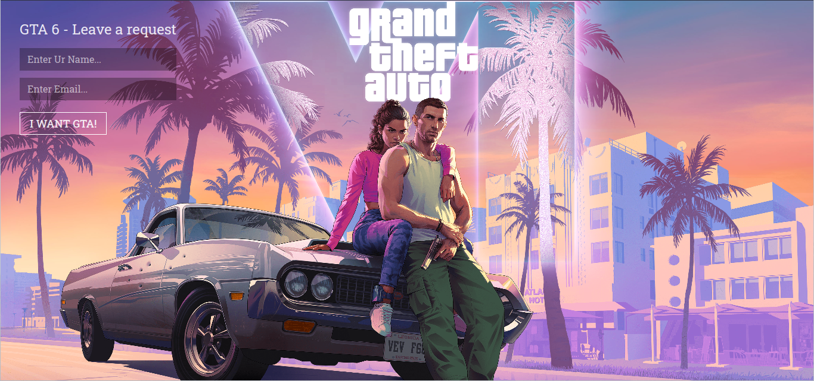
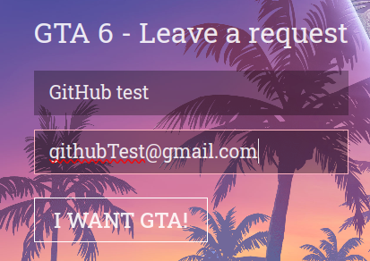
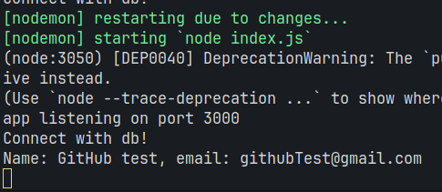
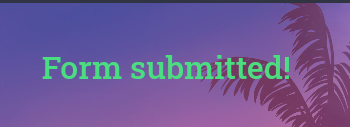
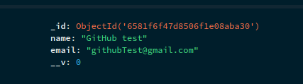

## GTA 6 Leave A Request [MERN]
> MERN - Mongodb, Express, React, NodeJS

### 🖼️ Site review
Entire site</img>
Fields</img>
Terminal from server</img>
Submitted form message</img>
MongoDB</img>

### 🕹️ Description
From the moment the user enters the site, he is greeted with <b>2 fields</b> and a <b>button</b>, the user’s name, and his email. These fields are <b>required</b>. There is also field validation with email. After clicking the button, a request is sent to the server, and it, in turn, <b>saves</b> the user data into the database. If the addition is successful, another component is <b>displayed</b> with a message stating that everything is <b>fine</b>.

### 🎨 Stack
- MongoDB
  - Mongoose
- ExpressJS
- React
  - Vite
  - TailwindCSS
  - ESlint
  - TypeScript (TS)
  - useState
  - useForm
- NodeJS
  - env (dotenv)
  - nodemon
